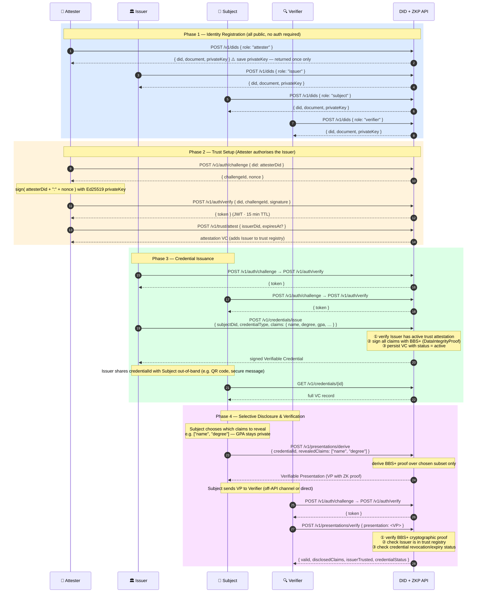
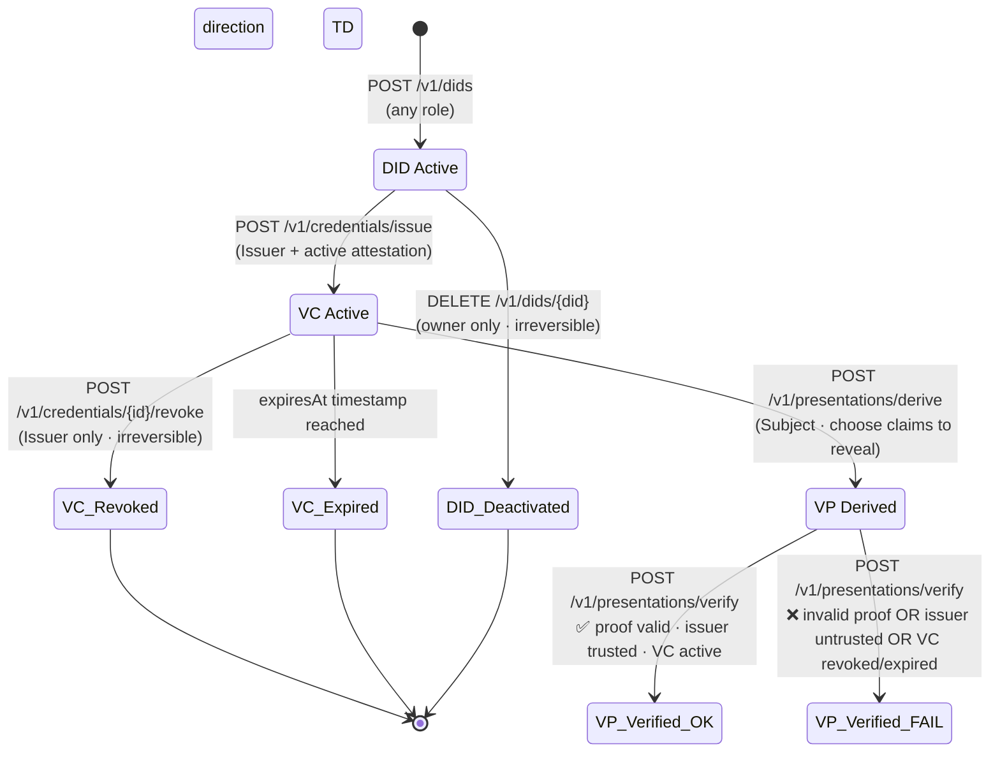
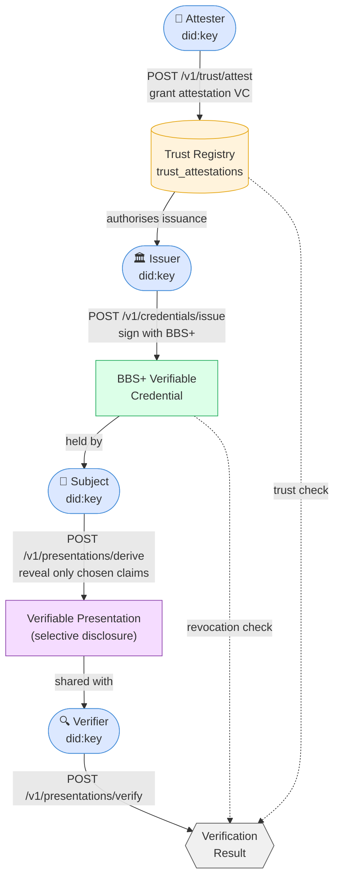

# DID + ZKP REST API

A production-ready REST API built with **Bun** and **Hono** that implements the [W3C Decentralized Identity (DID)](https://www.w3.org/TR/did-core/) protocol with **Zero-Knowledge Proofs** via **BBS+ signatures** for selective disclosure of Verifiable Credentials.

---

## Overview

This API enables four actor roles to participate in a full decentralized identity ecosystem:

| Role | Description |
|---|---|
| **Subject** | Holds credentials and creates selective-disclosure presentations |
| **Issuer** | Signs and issues Verifiable Credentials to subjects |
| **Verifier** | Verifies presented credentials and their proofs |
| **Attester** | Acts as a trust registry, vouching for issuer authority |

### Key Capabilities

- **`did:key`** — self-sovereign DID generation (Ed25519 + BLS12-381 G2 keys)
- **BBS+ Signatures** (`bbs-2023`) — sign multi-claim credentials and derive selective-disclosure proofs
- **W3C VC Data Model 2.0** — `DataIntegrityProof` with JSON-LD, fully spec-compliant
- **DID Auth** — challenge/response authentication using Ed25519 key signatures
- **Trust Registry** — attesters issue attestation VCs to authorize issuers
- **OWASP API Security Top 10** — compliant security controls throughout

---

## Identity Lifecycle

The full lifecycle spans four phases: **identity registration → trust setup → credential issuance → selective-disclosure verification**. Every actor starts with a DID and a private key, and the trust chain flows top-down from Attester to Issuer to Subject to Verifier.

### End-to-End Flow



---

### Credential & Presentation State Machine

Once a DID is created and the trust chain is established, credentials and presentations move through well-defined states. Revocation is permanent — a new credential must be issued to reinstate access.



---

### Trust Model at a Glance



> **Privacy guarantee:** The Verifier only ever sees the claims the Subject explicitly included in `revealedClaims`. All other claims in the original credential are cryptographically hidden — the BBS+ proof is mathematically indistinguishable from a proof over the full credential.

---

## Architecture

```
did-zkp/
├── src/
│   ├── domains/
│   │   ├── auth/          # DID Auth challenge/response, JWT sessions
│   │   ├── did/           # DID document management
│   │   ├── credentials/   # VC issuance, revocation, status
│   │   ├── presentation/  # BBS+ selective disclosure, VP verification
│   │   └── trust/         # Attester trust registry
│   ├── shared/
│   │   ├── crypto/        # AES-GCM key encryption, did:key, BBS+ wrappers
│   │   ├── jsonld/        # Offline JSON-LD context loader (no external HTTP)
│   │   └── middleware/    # Rate limiting, security headers, CORS
│   └── index.ts
├── tests/
│   ├── unit/
│   ├── integration/
│   └── security/
└── docs/
    └── superpowers/
        ├── specs/         # Design specification
        └── plans/         # Implementation plan
```

**Pattern:** Domain-Driven Modular — each domain owns its routes, service, and repository. Shared crypto and middleware are injected via explicit imports.

---

## Tech Stack

| Concern | Library |
|---|---|
| HTTP Framework | [Hono](https://hono.dev) (Bun-native) |
| BBS+ Signing / Verification | `@digitalbazaar/bbs-cryptosuite-2023` |
| JSON-LD Processing | `jsonld` (offline, no external HTTP) |
| `did:key` Resolution | `@digitalbazaar/did-method-key` |
| DataIntegrity Proofs | `@digitalbazaar/data-integrity` |
| Verifiable Credentials | `@digitalbazaar/vc` |
| Database | PostgreSQL via `postgres` npm |
| Input Validation | `zod` |
| Session Tokens | `jose` (JWT, 15-min TTL) |
| Key Encryption | AES-GCM (Web Crypto API, built into Bun) |

---

## API Endpoints

All endpoints are prefixed with `/v1`. Protected routes require `Authorization: Bearer <token>`.

### Authentication
| Method | Path | Auth | Description |
|---|---|---|---|
| `POST` | `/v1/auth/challenge` | Public | Request a one-time nonce for a DID |
| `POST` | `/v1/auth/verify` | Public | Submit signed nonce, receive JWT |

### DID Management
| Method | Path | Auth | Description |
|---|---|---|---|
| `POST` | `/v1/dids` | Public | Create a `did:key` identity (private key returned **once**) |
| `GET` | `/v1/dids/me` | Any role | Get your own DID document |
| `GET` | `/v1/dids/:did` | Public | Resolve any DID document |
| `DELETE` | `/v1/dids/:did` | Owner | Deactivate a DID |

### Verifiable Credentials
| Method | Path | Auth | Description |
|---|---|---|---|
| `POST` | `/v1/credentials/issue` | Issuer | Issue a BBS+-signed VC to a subject |
| `GET` | `/v1/credentials` | Issuer | List all issued VCs |
| `GET` | `/v1/credentials/:id` | Issuer / Subject | Fetch a VC by ID |
| `POST` | `/v1/credentials/:id/revoke` | Issuer | Revoke a credential |
| `GET` | `/v1/credentials/:id/status` | Public | Check credential status |

### Verifiable Presentations
| Method | Path | Auth | Description |
|---|---|---|---|
| `POST` | `/v1/presentations/derive` | Subject | Create a VP with BBS+ selective disclosure |
| `POST` | `/v1/presentations/verify` | Verifier | Verify a VP (proof + trust chain + revocation) |
| `GET` | `/v1/presentations/:id` | Subject | Fetch a previously derived presentation |

### Trust Registry
| Method | Path | Auth | Description |
|---|---|---|---|
| `POST` | `/v1/trust/attest` | Attester | Vouch for an issuer DID |
| `GET` | `/v1/trust/issuers` | Public | List all trusted issuers |
| `GET` | `/v1/trust/issuers/:did` | Public | Check if a DID is a trusted issuer |
| `POST` | `/v1/trust/attest/:id/revoke` | Attester | Revoke an issuer attestation |

---

## Core Flows

### 1. Bootstrap & Authentication

```
# Step 1: Create a DID (returns private key once — store it securely)
POST /v1/dids  { "role": "issuer" }
→ { did, document, privateKey }

# Step 2: Request a challenge
POST /v1/auth/challenge  { "did": "did:key:z6Mk..." }
→ { challengeId, nonce }

# Step 3: Sign the nonce with your Ed25519 private key
signature = Ed25519.sign(did + ":" + nonce, privateKey)

# Step 4: Exchange for a JWT session token (15-min TTL)
POST /v1/auth/verify  { did, challengeId, signature }
→ { token }
```

### 2. Issuing a Verifiable Credential

```
# Attester authorizes the issuer first
POST /v1/trust/attest  { "issuerDid": "did:key:..." }

# Issuer signs a VC with BBS+ (DataIntegrityProof)
POST /v1/credentials/issue
{
  "subjectDid": "did:key:...",
  "credentialType": ["UniversityDegree"],
  "claims": { "name": "Alice", "degree": "BSc", "gpa": "3.9" }
}
→ signed VC with DataIntegrityProof
```

### 3. Selective Disclosure Presentation

```
# Subject reveals only name and degree — GPA stays hidden
POST /v1/presentations/derive
{ "credentialId": "urn:uuid:...", "revealedClaims": ["name", "degree"] }
→ VP with BBS+ derived proof

# Verifier checks the proof, trust chain, and revocation status
POST /v1/presentations/verify  { "presentation": <VP> }
→ { valid: true, disclosedClaims, issuerTrusted: true, credentialStatus: "active" }
```

---

## Security

### OWASP API Security Top 10 Controls

| # | Threat | Control |
|---|---|---|
| API1 | Broken Object Level Authorization | Resource ownership enforced — callers can only access their own resources |
| API2 | Broken Authentication | Single-use nonces (5-min TTL), short-lived JWTs (15-min) |
| API3 | Broken Object Property Level Authorization | Response serializers strip fields by role |
| API4 | Unrestricted Resource Consumption | Rate limiting: 100 req/min general, 10 req/min on sensitive endpoints; 64KB body cap |
| API5 | Broken Function Level Authorization | Role checked at middleware level before any handler executes |
| API6 | Unsafe Business Flows | Issuance requires role + active trust attestation |
| API7 | SSRF | All JSON-LD contexts cached locally — zero outbound HTTP during request handling |
| API8 | Security Misconfiguration | CSP, HSTS, X-Frame-Options, X-Content-Type-Options on every response |
| API9 | Improper Inventory Management | All endpoints versioned under `/v1/` |
| API10 | Unsafe Input Consumption | Zod schemas on all inputs; JSON-LD `@context` allowlist |

### Additional Privacy Controls

- BBS+ selective disclosure — verifiers receive **only** the claims the subject chose to reveal
- Private keys stored AES-GCM encrypted; decrypted in-memory only during signing
- Private key returned only once at DID creation and never again
- Append-only `audit_log` table records every issuance, revocation, verification, and auth event — claim values are never logged

---

## Getting Started

### Prerequisites

- [Bun](https://bun.sh) >= 1.1
- PostgreSQL >= 14

### Setup

```bash
# Clone and install
git clone https://github.com/fparanso/did-zkp-api.git
cd did-zkp-api
bun install

# Configure environment
cp .env.example .env
# Edit .env — set DATABASE_URL, generate secrets:
openssl rand -hex 32   # → KEY_ENCRYPTION_SECRET
openssl rand -base64 32  # → JWT_SECRET

# Create the database
createdb did_zkp

# Start the server (runs migrations automatically on startup)
bun run dev
```

### Verify

```bash
curl http://localhost:3000/health
# → {"status":"ok"}
```

### Running Tests

```bash
# Create test database
createdb did_zkp_test

# Unit tests
bun test:unit

# Integration tests
bun test:integration

# Security (OWASP) tests
bun test:security

# All tests
bun test
```

---

## CLI Utilities

### Signature Generator
For local development and testing, you can use the built-in CLI signature generator to create signatures for the DID challenge-response authentication. It retrieves the required nonce and private key from your local database, signs the challenge, and outputs the base64-encoded signature:

```bash
bun run generate-signature.ts <did> <challengeId>
```

Example:
```bash
bun run generate-signature.ts "did:key:z6MknwjrNSCBRBYdCgSXPHFQXNyisvEWM3SuVYnT6d215XUC" "af003fcc-5012-42f9-b508-4f7e4d88236a"
```

---

## Environment Variables

| Variable | Required | Description |
|---|---|---|
| `DATABASE_URL` | Yes | PostgreSQL connection string |
| `TEST_DATABASE_URL` | Tests | PostgreSQL connection string for test DB |
| `KEY_ENCRYPTION_SECRET` | Yes | 64-char hex string (32 bytes) for AES-GCM key encryption |
| `JWT_SECRET` | Yes | Secret for signing session JWTs |
| `CORS_ORIGIN` | No | Allowed CORS origin (default: `http://localhost:3000`) |
| `PORT` | No | HTTP port (default: `3000`) |
| `NODE_ENV` | No | `development` or `production` |

---

## Database Schema

Seven tables cover the full protocol lifecycle:

- **`dids`** — DID documents, Ed25519 + BLS12-381 encrypted key pairs, role
- **`credentials`** — Signed VCs with BBS+ DataIntegrityProof
- **`presentations`** — Derived VPs with selective-disclosure proofs
- **`trust_attestations`** — Attestation VCs linking attesters to authorized issuers
- **`auth_challenges`** — Single-use nonces for DID Auth (5-min TTL)
- **`sessions`** — JWT session records (15-min TTL)
- **`audit_log`** — Append-only event log (UPDATE/DELETE blocked by DB trigger)

---

## Documentation

- [Design Spec](docs/superpowers/specs/2026-05-22-did-zkp-api-design.md) — architecture, data model, flows, security rationale
- [Implementation Plan](docs/superpowers/plans/2026-05-22-did-zkp-api.md) — 19-task TDD implementation guide

---

## Standards & References

- [W3C DID Core 1.0](https://www.w3.org/TR/did-core/)
- [W3C Verifiable Credentials Data Model 2.0](https://www.w3.org/TR/vc-data-model-2.0/)
- [BBS Cryptosuite 2023](https://www.w3.org/TR/vc-di-bbs/)
- [Data Integrity 1.0](https://www.w3.org/TR/data-integrity/)
- [did:key Method](https://w3c-ccg.github.io/did-method-key/)
- [OWASP API Security Top 10](https://owasp.org/API-Security/)
