# DID + HAIP REST API

A production-ready identity API aligned with the **OpenID4VC High Assurance Interoperability Profile 1.0 (HAIP)**. Issue, share, and verify tamper-proof digital credentials using **SD-JWT VC** (`dc+sd-jwt`) and **ISO 18013-5 mso_mdoc** — the same formats used in government digital ID programmes, EUDI wallets, and mobile driver's licences.

All cryptography is **P-256 / ES256** throughout — no external crypto libraries, no BLS, no JSON-LD. Built on Bun + Hono + PostgreSQL.

---

## Standards Alignment

| Standard | Role in this API |
|---|---|
| [OpenID4VC HAIP 1.0](https://openid.net/specs/openid4vc-high-assurance-interoperability-profile-1_0-final.html) | Top-level interoperability profile — mandates P-256, SD-JWT VC, DPoP, PKCE |
| [W3C DID Core 1.0](https://www.w3.org/TR/did-core/) | Every actor gets a `did:key` (P-256 multikey) — globally unique, self-sovereign |
| [SD-JWT VC (`dc+sd-jwt`)](https://www.ietf.org/archive/id/draft-ietf-oauth-sd-jwt-vc-08.html) | Credential format with per-claim salted hashes for selective disclosure |
| [ISO 18013-5 mso_mdoc](https://www.iso.org/standard/69084.html) | CBOR/COSE credential format used by mobile driver's licences and EUDI |
| [OID4VCI](https://openid.net/specs/openid-4-verifiable-credential-issuance-1_0.html) | Authorization-code issuance flow: PAR + PKCE + DPoP + key proof JWT |
| [OID4VP](https://openid.net/specs/openid-4-verifiable-presentations-1_0.html) | Verifier-initiated presentation flow: signed JAR + KB-JWT holder binding |
| [Token Status List 1.0](https://www.ietf.org/archive/id/draft-ietf-oauth-status-list-06.html) | Compact bitmap revocation registry signed as a JWT |
| [RFC 9449 — DPoP](https://www.rfc-editor.org/rfc/rfc9449) | Demonstration of Proof of Possession — key-bound access tokens |
| [OWASP API Security Top 10](https://owasp.org/API-Security/) | Security controls on every endpoint |

---

## Actors & Roles

| Role | Responsibility |
|---|---|
| **Attester** | Trust anchor — vouches for which issuers may sign credentials |
| **Issuer** | Signs SD-JWT VC + mso_mdoc credentials for subjects (requires active trust attestation) |
| **Subject / Wallet** | Holds credentials; derives selective-disclosure presentations |
| **Verifier** | Validates presentations against cryptographic proof, trust chain, and revocation |
| **Admin** | Upgrades account roles via server-side secret |

---

## How It Works — Concept Overview

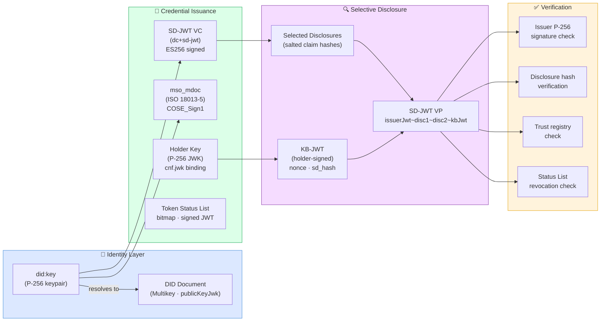

---

## Part 1 — Identity Creation

### 1-A. Generating a DID (P-256 `did:key`)

Every actor — human or machine — starts by generating a `did:key` identity backed by a **P-256 keypair**. The DID is derived deterministically from the compressed public key using a multicodec prefix.

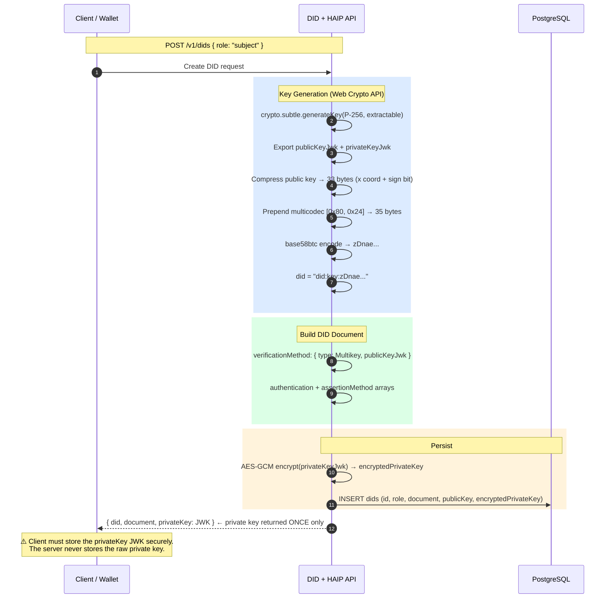

**What you get back:**
```json
{
  "did": "did:key:zDnaeWJjH...",
  "role": "subject",
  "document": {
    "@context": ["https://www.w3.org/ns/did/v1"],
    "id": "did:key:zDnaeWJjH...",
    "verificationMethod": [{
      "type": "Multikey",
      "publicKeyJwk": { "kty": "EC", "crv": "P-256", "x": "...", "y": "..." }
    }]
  },
  "privateKey": { "kty": "EC", "crv": "P-256", "x": "...", "y": "...", "d": "..." }
}
```

---

### 1-B. Authenticating with Your DID (P-256 Challenge-Response)

Once you have a DID, you authenticate using a **cryptographic challenge-response** — no password required.

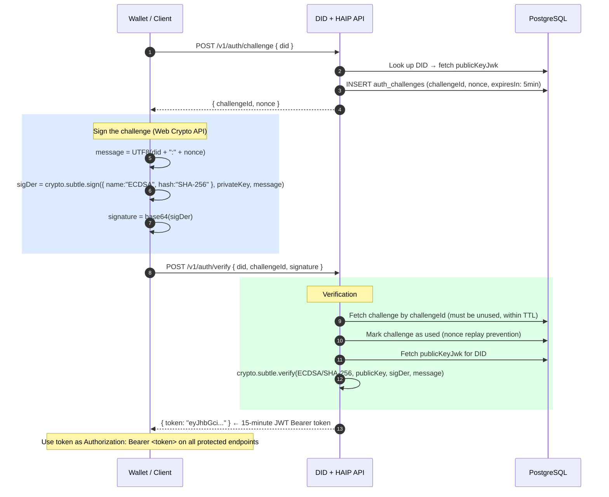

---

## Part 2 — Credential Issuance (Direct REST API)

### 2-A. Trust Setup — Authorising an Issuer

Before an issuer can sign credentials, an **attester** must vouch for them in the trust registry.

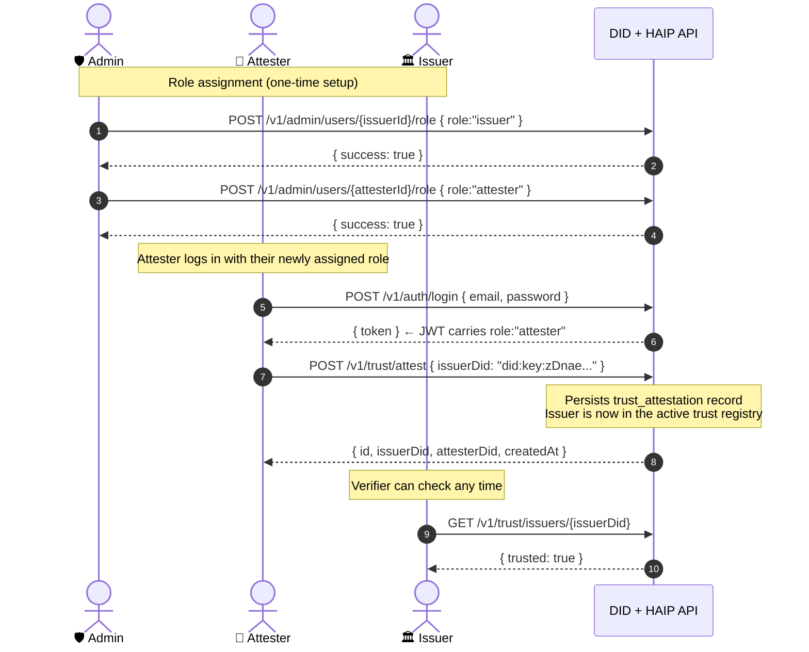

---

### 2-B. Issuing an SD-JWT VC + mso_mdoc Credential

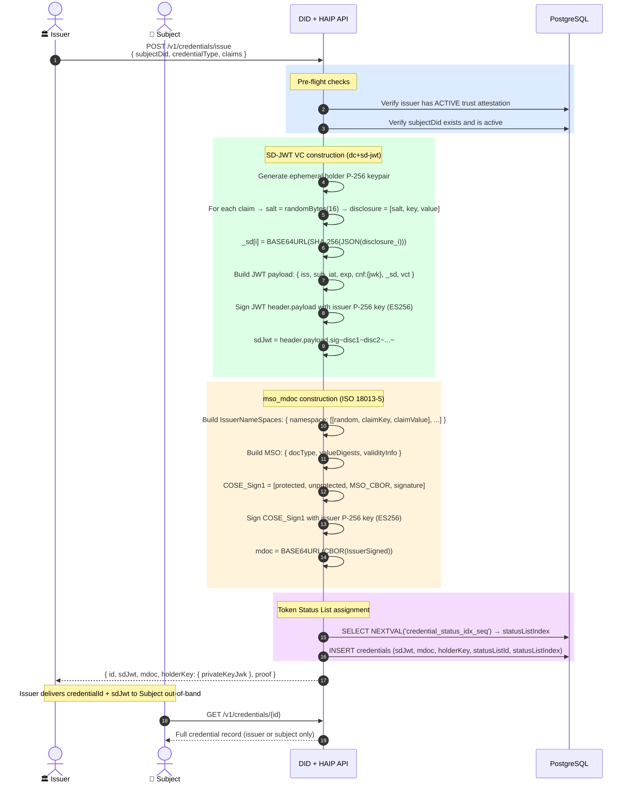

**What the SD-JWT VC looks like internally:**

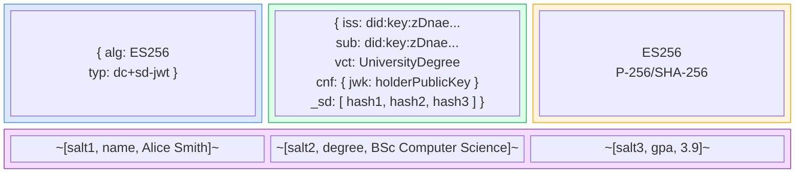

---

## Part 3 — Selective Disclosure & Verification

### 3-A. Subject Derives a Selective-Disclosure Presentation

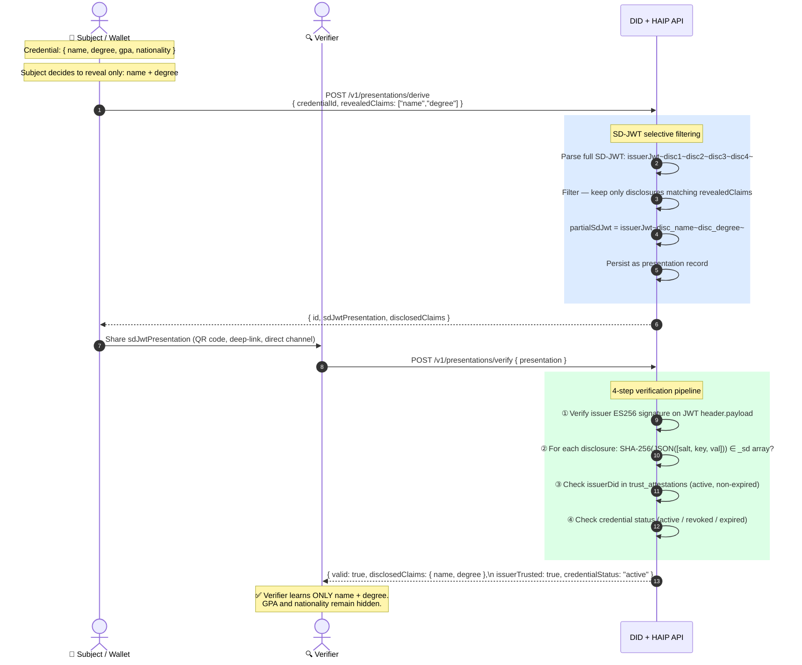

---

## Part 4 — OID4VCI (Machine-to-Machine Issuance)

For wallet-to-server issuance following the HAIP 1.0 authorization-code flow with **PAR + PKCE + DPoP**.

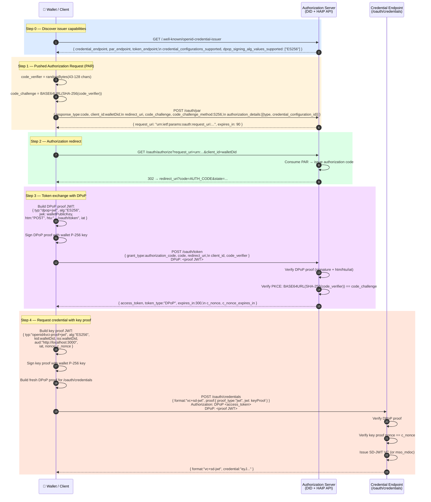

---

## Part 5 — OID4VP (Verifier-Initiated Presentation)

HAIP-compliant wallet presentation using **signed JAR request objects**, **direct_post**, and **KB-JWT holder binding**.

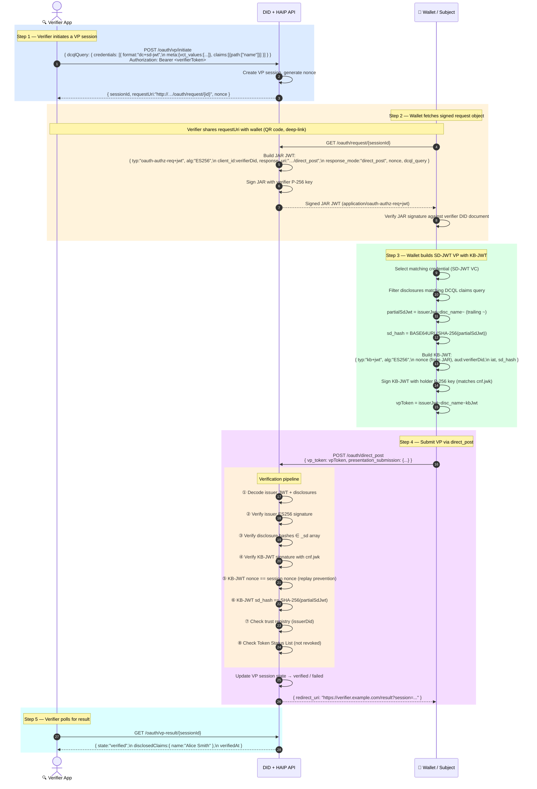

---

## Part 6 — KB-JWT Anatomy (Holder Binding)

The Key Binding JWT is what proves the person presenting the credential actually holds the private key corresponding to `cnf.jwk` in the issued credential.

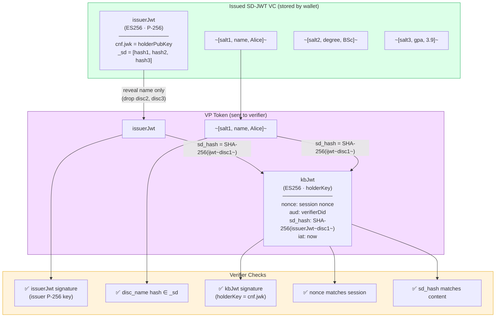

---

## Part 7 — Revocation via Token Status List

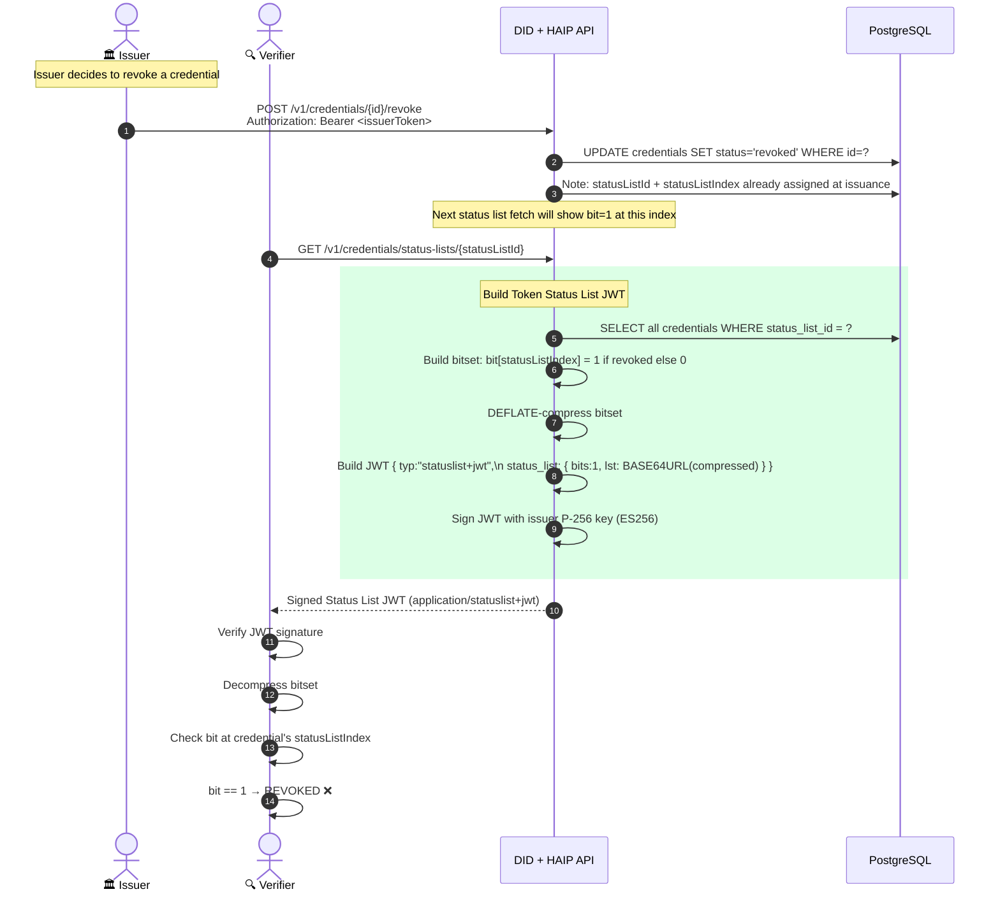

---

## Full End-to-End Lifecycle

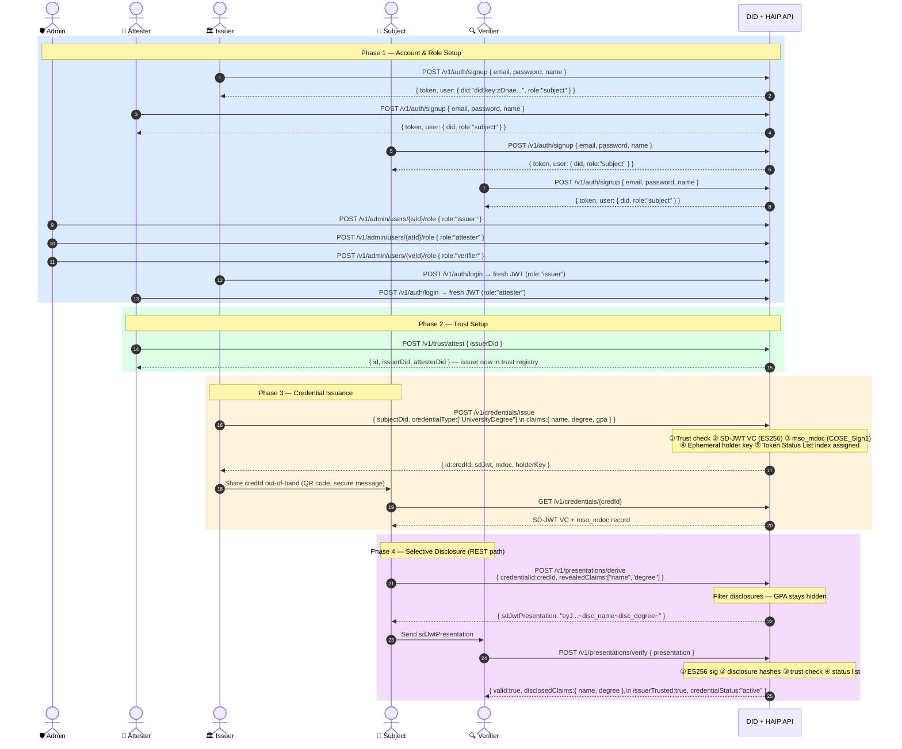

---

## Credential & Presentation State Machine

```mermaid
stateDiagram-v2
    direction LR

    [*] --> Account_Created : POST /v1/auth/signup

    state "Account\n(role: subject)" as Account_Created
    state "Role Upgraded\n(issuer / attester / verifier)" as Role_Upgraded
    state "Issuer Trusted\n(active attestation)" as Issuer_Trusted
    state "Credential Issued\n(SD-JWT VC + mso_mdoc)" as VC_Active
    state "Presentation Derived\n(selective SD-JWT)" as VP_Derived
    state "Presentation Verified ✅" as VP_OK
    state "Presentation Failed ❌" as VP_FAIL
    state "Revoked" as VC_Revoked
    state "Expired" as VC_Expired

    Account_Created --> Role_Upgraded : POST /v1/admin/users/{id}/role
    Role_Upgraded --> Issuer_Trusted : POST /v1/trust/attest\n(attester vouches for issuer)
    Issuer_Trusted --> VC_Active : POST /v1/credentials/issue\n(ES256 SD-JWT + COSE_Sign1 mdoc)

    VC_Active --> VP_Derived : POST /v1/presentations/derive\n(subject · choose revealedClaims)
    VC_Active --> VC_Revoked : POST /v1/credentials/{id}/revoke\n(issuer · bit flipped in Status List)
    VC_Active --> VC_Expired : expiresAt reached

    VP_Derived --> VP_OK : POST /v1/presentations/verify\n✅ sig · hashes · trust · status
    VP_Derived --> VP_FAIL : POST /v1/presentations/verify\n❌ invalid sig OR revoked OR untrusted

    VC_Revoked --> [*]
    VC_Expired --> [*]
```

---

## Architecture

```
did-zkp/
├── src/
│   ├── domains/
│   │   ├── auth/           # DID challenge/response + JWT sessions
│   │   ├── users/          # Email/password accounts, profile, password reset, admin
│   │   ├── organizations/  # Org management, member roles, invites
│   │   ├── did/            # did:key creation and resolution (P-256)
│   │   ├── credentials/    # SD-JWT VC + mso_mdoc issuance, revocation, Token Status List
│   │   ├── presentation/   # SD-JWT selective disclosure + VP verification
│   │   ├── trust/          # Attester trust registry
│   │   └── oauth/          # OID4VCI (PAR · authorize · token · credentials)
│   │                       # OID4VP (vp/initiate · request · direct_post · vp-result)
│   ├── shared/
│   │   ├── crypto/
│   │   │   ├── p256.ts     # P-256 key generation, did:key multicodec encoding
│   │   │   ├── sd-jwt.ts   # SD-JWT VC issuance, selective disclosure, KB-JWT verification
│   │   │   ├── mdoc.ts     # ISO 18013-5 IssuerSigned builder + COSE_Sign1
│   │   │   ├── did-key.ts  # did:key document builder (Multikey / P-256)
│   │   │   └── keys.ts     # AES-GCM key encryption
│   │   └── middleware/     # Rate limiting, security headers, CORS
│   └── index.ts
├── tests/
│   ├── unit/crypto/        # sd-jwt, mdoc, p256 unit tests
│   ├── integration/        # Full lifecycle + revocation + trust
│   └── security/           # OWASP API Top 10 tests
├── migrations/
│   ├── 001–005_*.sql       # Base schema
│   ├── 006_haip_p1.sql     # P-256, SD-JWT columns, status list sequence
│   ├── 007_haip_p2.sql     # OID4VCI tables (PAR, auth codes, DPoP nonces)
│   └── 008_haip_p3.sql     # OID4VP table (VP sessions)
└── docs/superpowers/
    ├── specs/              # HAIP migration design spec
    └── plans/              # 13-task TDD implementation plan
```

---

## Tech Stack

| Concern | Library / API |
|---|---|
| HTTP Framework | [Hono](https://hono.dev) (Bun-native) |
| Cryptography | **Web Crypto API** (built into Bun) — P-256 keygen, ECDSA sign/verify, SHA-256 |
| CBOR encode/decode | `cbor2` — for mso_mdoc / COSE_Sign1 |
| JWT / JWK | `jose` — import/export JWK, JWT sign/verify |
| Database | PostgreSQL via `postgres` npm |
| Input Validation | `zod` |
| Session Tokens | `jose` (JWT HS256, 15-min TTL) |
| Key Encryption | AES-GCM (Web Crypto API) |
| Password Hashing | Bun built-in Argon2id (OWASP params) |

> **No external crypto libraries** — BLS12-381, `@digitalbazaar/*`, `jsonld`, and `@mattrglobal/bbs-signatures` have all been removed. All operations use the P-256 primitives available natively in the Bun/Web Crypto API.

---

## API Endpoints

All v1 endpoints are prefixed `/v1`. Protected routes require `Authorization: Bearer <token>`.

### Email Auth
| Method | Path | Auth | Description |
|---|---|---|---|
| `POST` | `/v1/auth/signup` | Public | Create account; P-256 `did:key` auto-generated |
| `POST` | `/v1/auth/login` | Public | Exchange email + password for JWT |
| `POST` | `/v1/auth/forgot-password` | Public | Request password reset token |
| `POST` | `/v1/auth/reset-password` | Public | Consume reset token, set new password |

### DID Authentication (challenge-response)
| Method | Path | Auth | Description |
|---|---|---|---|
| `POST` | `/v1/auth/challenge` | Public | Request one-time nonce for a DID |
| `POST` | `/v1/auth/verify` | Public | Submit P-256 ECDSA signature, receive JWT |

### DID Management
| Method | Path | Auth | Description |
|---|---|---|---|
| `POST` | `/v1/dids` | Public | Generate P-256 `did:key` (private JWK returned **once**) |
| `GET` | `/v1/dids/me` | Any role | Get your own DID document |
| `GET` | `/v1/dids/:did` | Public | Resolve any DID document |
| `DELETE` | `/v1/dids/:did` | Owner | Deactivate a DID |

### Users
| Method | Path | Auth | Description |
|---|---|---|---|
| `GET` | `/v1/users/me` | Any role | Get profile (includes org memberships) |
| `PATCH` | `/v1/users/me` | Any role | Update name or organizationName |

### Admin
| Method | Path | Auth | Description |
|---|---|---|---|
| `POST` | `/v1/admin/users/:id/role` | `X-Admin-Secret` | Upgrade user's DID role |

### Organizations
| Method | Path | Auth | Description |
|---|---|---|---|
| `POST` | `/v1/organizations` | Any role | Create org with its own P-256 DID |
| `GET` | `/v1/organizations/:id` | Member | Get org details |
| `DELETE` | `/v1/organizations/:id` | Owner | Delete org and deactivate its DID |
| `GET` | `/v1/organizations/:id/members` | Member | List members |
| `POST` | `/v1/organizations/:id/invites` | Admin/Owner | Invite user by email |
| `POST` | `/v1/organizations/invites/:token/accept` | Any role | Accept pending invite |
| `PATCH` | `/v1/organizations/:id/members/:userId` | Admin/Owner | Change member's org role |
| `DELETE` | `/v1/organizations/:id/members/:userId` | Admin/Owner or self | Remove member |

### Verifiable Credentials
| Method | Path | Auth | Description |
|---|---|---|---|
| `POST` | `/v1/credentials/issue` | Issuer | Issue SD-JWT VC + mso_mdoc to subject |
| `GET` | `/v1/credentials` | Issuer | List all issued credentials |
| `GET` | `/v1/credentials/:id` | Issuer / Subject | Fetch credential by ID |
| `POST` | `/v1/credentials/:id/revoke` | Issuer | Revoke credential (updates Token Status List) |
| `GET` | `/v1/credentials/:id/status` | Public | Check credential status |
| `GET` | `/v1/credentials/status-lists/:id` | Public | Token Status List 1.0 JWT |

### Verifiable Presentations
| Method | Path | Auth | Description |
|---|---|---|---|
| `POST` | `/v1/presentations/derive` | Subject | Derive SD-JWT selective-disclosure VP |
| `POST` | `/v1/presentations/verify` | Verifier | Verify VP (sig + hashes + trust + revocation) |
| `GET` | `/v1/presentations/:id` | Subject | Fetch previously derived presentation |

### Trust Registry
| Method | Path | Auth | Description |
|---|---|---|---|
| `POST` | `/v1/trust/attest` | Attester | Vouch for an issuer DID |
| `GET` | `/v1/trust/issuers` | Public | List all trusted issuers |
| `GET` | `/v1/trust/issuers/:did` | Public | Check if DID is a trusted issuer |
| `POST` | `/v1/trust/attest/:id/revoke` | Attester | Revoke an issuer attestation |

### OID4VCI (HAIP authorization-code flow)
| Method | Path | Auth | Description |
|---|---|---|---|
| `GET` | `/.well-known/openid-credential-issuer` | Public | OID4VCI issuer metadata |
| `POST` | `/oauth/par` | Public | Pushed Authorization Request (PAR + PKCE) |
| `GET` | `/oauth/authorize` | Public | Authorization code redirect |
| `POST` | `/oauth/token` | DPoP | Token endpoint (DPoP-bound access token + c_nonce) |
| `POST` | `/oauth/nonce` | DPoP | Refresh c_nonce |
| `POST` | `/oauth/credentials` | DPoP | Credential endpoint (key proof JWT required) |

### OID4VP (HAIP verifier-initiated flow)
| Method | Path | Auth | Description |
|---|---|---|---|
| `POST` | `/oauth/vp/initiate` | Verifier | Start VP session (DCQL query) |
| `GET` | `/oauth/request/:id` | Public | Fetch signed JAR request object |
| `POST` | `/oauth/direct_post` | Public | Submit VP token (SD-JWT + KB-JWT) |
| `GET` | `/oauth/vp-result/:id` | Verifier | Poll VP verification result |

---

## Security

### OWASP API Security Top 10

| # | Threat | Control |
|---|---|---|
| API1 | Broken Object Level Authorization | Ownership enforced per resource; org invite BOLA: caller email must match invite email |
| API2 | Broken Authentication | Single-use nonces (5-min TTL); P-256 ECDSA sig verification; short-lived JWTs (15-min); Argon2id passwords; timing-safe comparison; DPoP proof anti-replay |
| API3 | Broken Object Property Level Authorization | Response serializers strip fields by role |
| API4 | Unrestricted Resource Consumption | Rate limiting: 100 req/min general, 10 req/min on issuance; 64 KB body cap |
| API5 | Broken Function Level Authorization | Role checked at middleware before any handler; org role hierarchy (member < admin < owner) enforced per operation |
| API6 | Unsafe Business Flows | Issuance requires role + active trust attestation; last-owner removal blocked; KB-JWT nonce binding prevents VP replay |
| API7 | SSRF | Zero outbound HTTP during request handling (no JSON-LD, no external resolvers) |
| API8 | Security Misconfiguration | CSP, HSTS, X-Frame-Options, X-Content-Type-Options, Cache-Control: no-store on every response |
| API9 | Improper Inventory Management | All endpoints versioned under `/v1/` or `/oauth/` |
| API10 | Unsafe Input Consumption | Zod schemas on all inputs; DPoP htm/htu/iat validation |

### Privacy Controls

- **SD-JWT selective disclosure** — verifiers receive *only* the claims the subject chose to reveal; all other claims are cryptographically hidden
- **Holder binding via KB-JWT** — proves the presenter holds the private key matching `cnf.jwk`; prevents credential theft attacks
- **DPoP (RFC 9449)** — access tokens are key-bound; stolen tokens cannot be replayed from a different client
- **Private keys never stored** — raw private keys returned only once at creation; server stores AES-GCM encrypted form, decrypts only during signing
- **Append-only audit log** — every issuance, revocation, verification, and auth event recorded; claim values never logged
- **Password reset** — all active sessions invalidated on successful reset

---

## Getting Started

### Prerequisites

- [Bun](https://bun.sh) >= 1.1
- PostgreSQL >= 14

### Setup

```bash
# Clone and install
git clone https://github.com/fparanso/did-zkp-api.git
cd did-zkp-api
bun install

# Configure environment
cp .env.example .env
# Generate secrets:
openssl rand -hex 32    # → KEY_ENCRYPTION_SECRET
openssl rand -base64 32 # → JWT_SECRET
openssl rand -hex 32    # → ADMIN_SECRET

# Create the database
createdb did_zkp

# Start the server (runs all migrations automatically)
bun run dev
```

### Verify

```bash
curl http://localhost:3000/health
# → {"status":"ok"}

# Discover OID4VCI capabilities
curl http://localhost:3000/.well-known/openid-credential-issuer
```

### Interactive API Docs

Open [http://localhost:3000/docs](http://localhost:3000/docs) for the Scalar UI — all 44 endpoints with schemas, examples, and try-it-out.

### Running Tests

```bash
createdb did_zkp_test

bun test:unit         # Crypto unit tests (SD-JWT, mso_mdoc, P-256)
bun test:integration  # Full lifecycle + revocation + trust flows
bun test:security     # OWASP API Top 10 security tests
bun test              # All tests
```

---

## Environment Variables

| Variable | Required | Description |
|---|---|---|
| `DATABASE_URL` | Yes | PostgreSQL connection string |
| `TEST_DATABASE_URL` | Tests | PostgreSQL connection string for test DB |
| `KEY_ENCRYPTION_SECRET` | Yes | 64-char hex (32 bytes) for AES-GCM private key encryption |
| `JWT_SECRET` | Yes | Secret for signing session JWTs |
| `ADMIN_SECRET` | Yes | Secret for `X-Admin-Secret` header on admin endpoints |
| `CORS_ORIGIN` | No | Allowed CORS origin (default: `http://localhost:3000`) |
| `PORT` | No | HTTP port (default: `3000`) |
| `NODE_ENV` | No | `development` or `production` |

---

## Database Schema

### Account & Identity
- **`users`** — email/password accounts, name, FK → dids
- **`password_reset_tokens`** — one-time reset tokens with expiry
- **`dids`** — DID documents, P-256 public key JWK, AES-GCM encrypted private key, role
- **`sessions`** — JWT session records (15-min TTL)
- **`auth_challenges`** — single-use nonces for DID challenge-response (5-min TTL)

### Organizations
- **`organizations`** — org name, slug, DID, owner FK
- **`org_members`** — user ↔ org membership with role
- **`org_invites`** — pending invites with email, token, expiry

### Credentials & Trust
- **`credentials`** — SD-JWT VC, mso_mdoc, holder key, Token Status List position, status
- **`presentations`** — derived SD-JWT VPs (issuer JWT + selected disclosures)
- **`trust_attestations`** — attestation records linking attesters to authorized issuers
- **`audit_log`** — append-only event log (DB trigger blocks UPDATE/DELETE)

### OID4VCI
- **`oauth_par_requests`** — PAR entries with PKCE code_challenge, authorization_details (90s TTL)
- **`oauth_auth_codes`** — authorization codes post-redirect (5-min TTL)
- **`oauth_dpop_nonces`** — DPoP nonce anti-replay store

### OID4VP
- **`vp_sessions`** — VP session state (pending → verified / failed / expired), DCQL query, nonce, result

---

## Standards & References

- [OpenID4VC HAIP 1.0](https://openid.net/specs/openid4vc-high-assurance-interoperability-profile-1_0-final.html)
- [SD-JWT VC — draft-ietf-oauth-sd-jwt-vc](https://www.ietf.org/archive/id/draft-ietf-oauth-sd-jwt-vc-08.html)
- [SD-JWT — RFC draft-ietf-oauth-selective-disclosure-jwt](https://datatracker.ietf.org/doc/draft-ietf-oauth-selective-disclosure-jwt/)
- [Token Status List — draft-ietf-oauth-status-list](https://www.ietf.org/archive/id/draft-ietf-oauth-status-list-06.html)
- [OID4VCI](https://openid.net/specs/openid-4-verifiable-credential-issuance-1_0.html)
- [OID4VP](https://openid.net/specs/openid-4-verifiable-presentations-1_0.html)
- [RFC 9449 — DPoP](https://www.rfc-editor.org/rfc/rfc9449)
- [RFC 9126 — PAR](https://www.rfc-editor.org/rfc/rfc9126)
- [ISO 18013-5 mso_mdoc](https://www.iso.org/standard/69084.html)
- [W3C DID Core 1.0](https://www.w3.org/TR/did-core/)
- [OWASP API Security Top 10](https://owasp.org/API-Security/)
